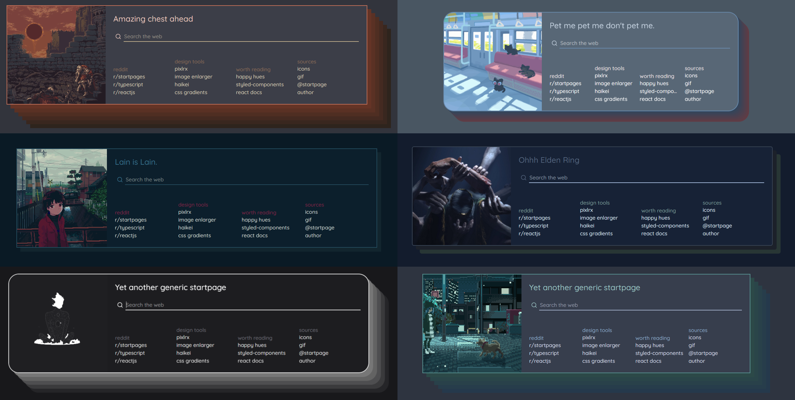

# starttab

starttab is a custom start page for your browser, also it's:

- 🆓 **Free**: hosted on Github pages
- 🔒 **Private**: no database
- ⚡ **Lightweight**: zero dependencies

→ Try [HERE](https://zaeboba.github.io/page/starttab/)

## Guides

  
⚙ installation

  
   
  
 
  #### 🔴 Chrome
  
  I included a simple manifest.json so you can import it as a chrome extension.
just clone this repo and load unpacked extension. (you have to enable developer mode)

The above shown themes are available as backups in /themes. Download the json and import it via the startpage.

  

## ❤️

  
❤️ thx

  
   
  
 
  thanks for the opportunity to steal this beautiful home page 
  #### PrettyCoffee

  

